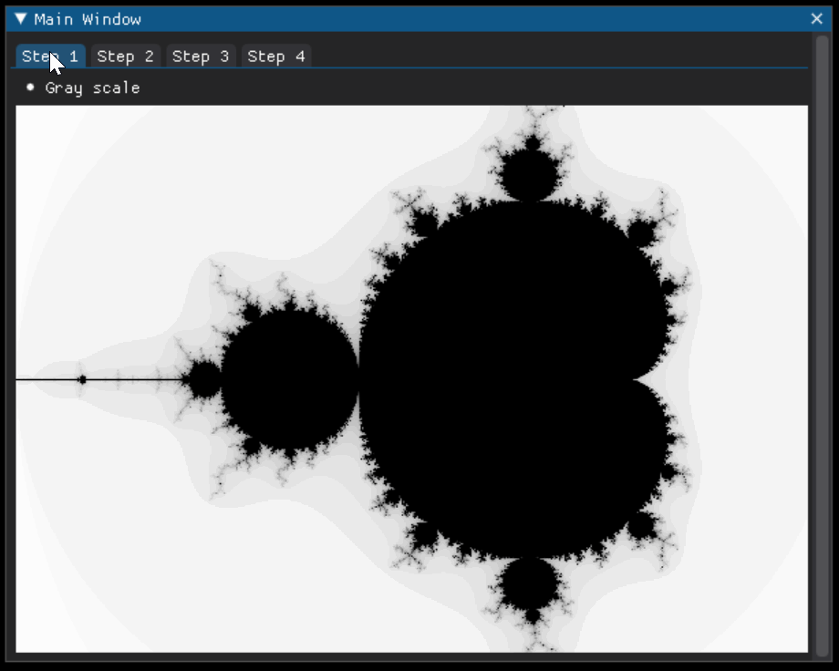

# Maldebrot_dearpygui

4 steps of generating mandelbrot pattern and visualizing it in dearpygui window.

Here is a preview:

TODO:

- zoom
  
  

ispired by https://www.codingame.com/playgrounds/2358/how-to-plot-the-mandelbrot-set/mandelbrot-set

